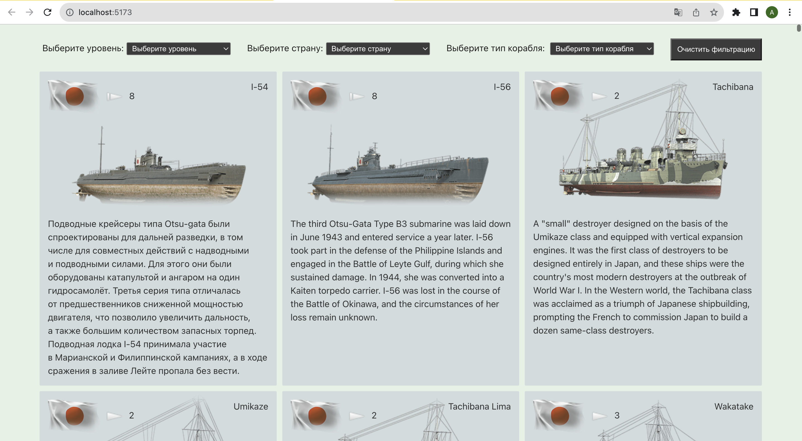
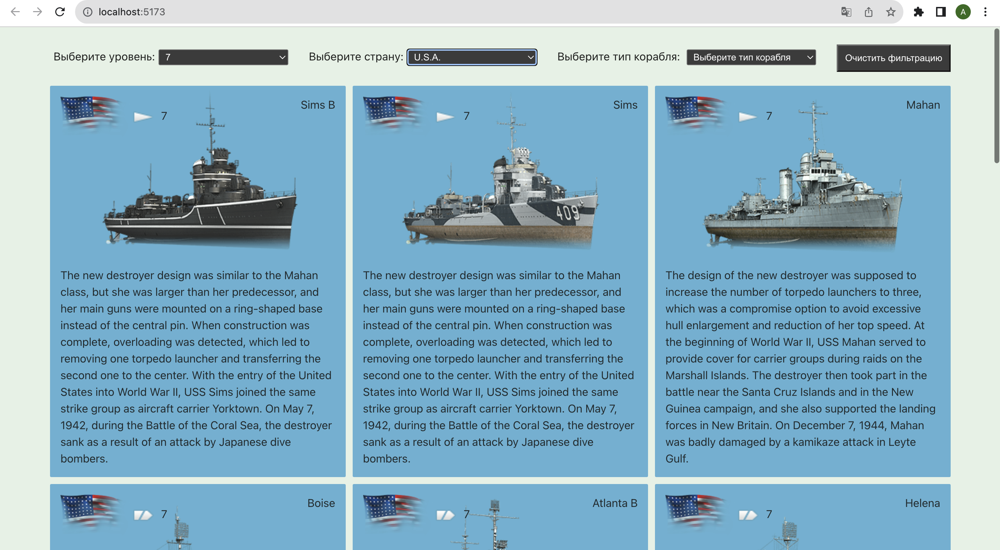

# Проект [VK](https://github.com/AlexFromNorth/vk) | Frontend / Firebase

### 📜 Описание:
Single Page Application c использованием `React` созданный для отображения кораблей из игры "Мир кораблей". Созданно с применением `Vite` и имеет переиспользуемые компоненты. Данные берутся через через запрос на Апи используя `Apollo`. Для хранений данных применен store от `Redux/Toolkit`.

### 📲 Как пользоватся:
* Откройте веб-страницу(инструкция прикреплена ниже) и отфильтруйте корабли по необходимым критериям.

### ⚙️ Функционал:
* Single Page Application на Create React App в рамках одной страницы без перезагрузок.

* Запрос к Апи
  
* Фильтрация данных по элементам Section

* Для формы авторизации использовал Firebase с валидацией.


### 🥞 Стек:

 `React` `Redux/Toolkit` `TypeScript` `Apollo` `SCSS`

### 💽 Установка и запуск:

1. Склонировать репозиторий в текущую папку:

```git clone https://github.com/AlexFromNorth/LestaGame_TZ.git ./```

2. Установить зависимости:

```yarn install```

3. Запустить проект в режиме разработки:

```yarn start или yarn run dev```

<br />
<br />

<br />
<br />

<br />
<br />

